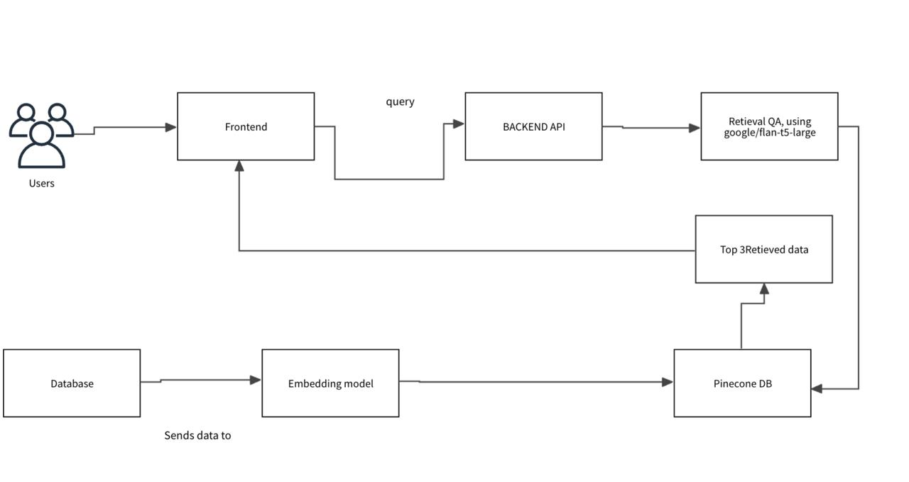

# 🔐 CloudForge – CVE Tracking Microservice with DevSecOps and Cloud-Native Observability

CloudForge is a backend-driven microservice built in Go, designed to monitor and track Common Vulnerabilities and Exposures (CVEs). It integrates Kafka for event-driven messaging and PostgreSQL for data persistence, all deployed with robust DevSecOps practices using Jenkins, Helm, and AWS infrastructure.

---

## 🧰 Tech Stack

- **Language**: Go (Golang)
- **Messaging**: Apache Kafka (for CVE pub/sub)
- **Database**: PostgreSQL
- **Cloud**: AWS (EC2, IAM, VPC, CloudWatch)
- **Orchestration**: Helm, Istio
- **CI/CD**: Jenkins (Groovy scripts)
- **Monitoring & Observability**: Grafana, Prometheus

---

## 🔐 Key Features

- 📡 Kafka-based publish/subscribe model for CVE event tracking  
- 💾 PostgreSQL-backed microservice for secure data storage  
- 🔁 CI/CD pipelines implemented using Jenkins with Groovy scripts  
- 🔒 Istio service mesh for traffic control, security, and observability  
- 📊 Real-time monitoring using Prometheus and Grafana  
- 🛡️ IAM roles and policies enforced for secure AWS deployments

---

## ⚙️ Deployment Architecture

- Microservices deployed on AWS EC2 instances inside a secure VPC  
- Kafka handles ingestion and processing of vulnerability feeds  
- Jenkins pipeline automates build → test → deploy cycle  
- Istio enables service-to-service security and traffic flow control  
- Helm charts manage deployment state and updates  
- Prometheus + Grafana provide end-to-end observability

---

## 🖼 Architecture Diagram

---

## 🔗 Links

- 📂 GitHub Repo: [Cloud_Craft](https://github.com/orgs/cloud-forge-advance-cloud/repositories)  
- 🔗 [LinkedIn](https://www.linkedin.com/in/poojakannanpk/)

---

## 📄 License  
MIT License
